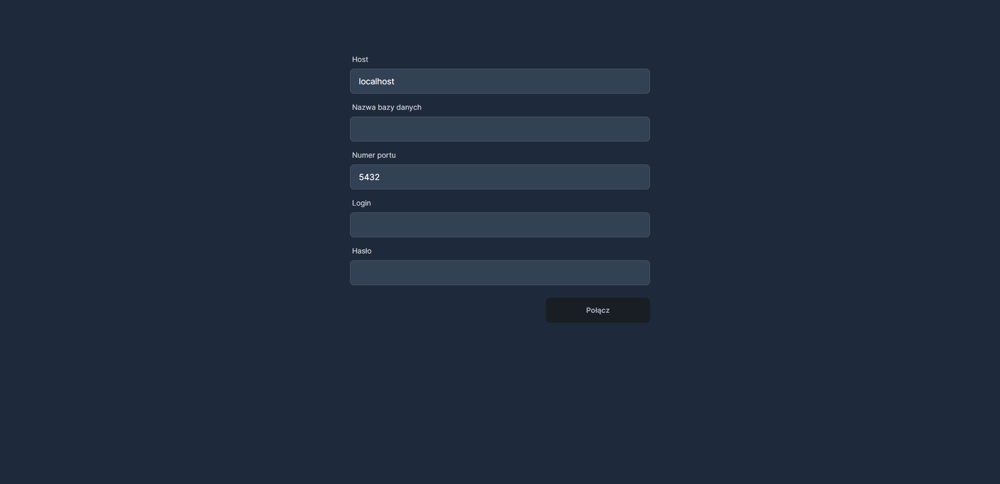

# Database Connection Application

## Overview

This application is a full-stack web application built using Next.js. It provides a user interface for connecting to a database and a backend API for handling the connection requests. The application is managed using `pnpm`, an efficient package manager for JavaScript.

## Features

- **Full-Stack Architecture**: Combines a front-end built with React and a backend API using Next.js.
- **Database Connection**: Users can input details like database name, port number, login, and password to connect to a database.
- **Form Validation**: Ensures that all form fields are filled before attempting a connection.
- **Connection Status Feedback**: Provides visual feedback indicating the success or failure of the database connection attempt.
- **Backend API**: A RESTful API endpoint for database connection using PostgreSQL client.

## Technologies Used

- **Next.js**: A React framework for building server-side rendering and static web applications.
- **React Hook Form**: For managing form state and validation.
- **Axios**: Promise-based HTTP client for browser and Node.js.
- **React Query**: For handling server state in React applications.
- **Tailwind CSS**: A utility-first CSS framework.
- **pnpm**: Efficient and fast package manager for JavaScript and Node.js projects.
- **PostgreSQL (pg)**: A PostgreSQL client for Node.js.

## Backend API

The backend API is built within Next.js and uses the PostgreSQL client for establishing a database connection. The API accepts connection details (database name, login, password, port, and host), creates a connection pool, and attempts to connect to the database. It responds with a success or error message based on the connection outcome.

## Installation

1. Clone the repository.
2. Install the dependencies using `pnpm install`.
3. Build the application using `pnpm build`.
4. Start the application using `pnpm start`.

## Usage

1. Open the application in a web browser.
2. Fill in the required fields: Database Name, Port Number, Login, and Password.
3. Click the "Połącz" (Connect) button to attempt a connection.
4. The application will display a success or error message based on the outcome of the connection attempt.
